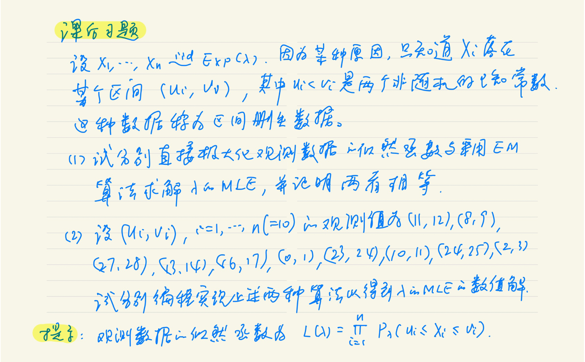
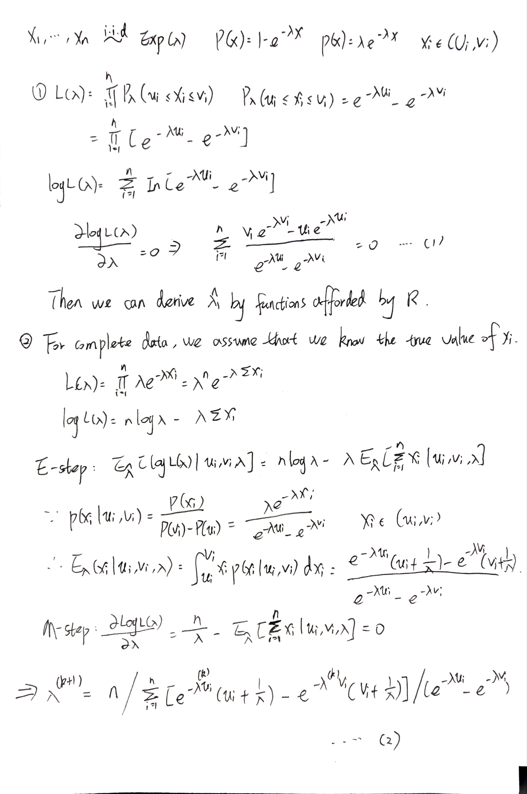
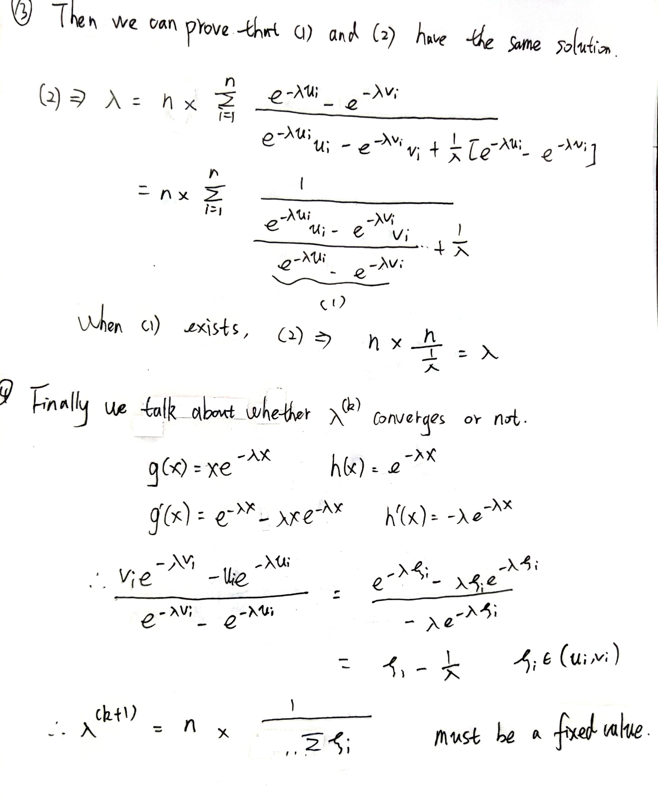

# Overview

All my homework answers about Statistical Computing class including from hw0 to hw10 is as follows.

# HW0: "A-22015-2022-09-09"

## Example 1

#### Simple description: some exercises about R basic use.

```{r}
seq(1, 5, 0.5)
seq(length=9, from=1, to=5)
rep(1,5)
sequence(4:5)
gl(2, 6, label=c("Male", "Female"))
expand.grid(h=c(60,80), w=c(100, 300), sex=c("Male", "Female"))
qnorm(0.975)
matrix(1:6, 2, 3, byrow=TRUE)
ts(1:47, frequency = 12, start = c(1959, 2))
```

## Example 2

#### Simple description: try to draw pictures.

```{r echo=FALSE}
x = rnorm(10)
y = rnorm(10)
plot(x, y, xlab="Ten random values", ylab="Ten other values",
     xlim=c(-2, 2), ylim=c(-2, 2), pch=22, col="red",
     bg="yellow", bty="l", tcl=0.4,
     main="How to customize a plot with R", las=1, cex=1.5)
```
```{r}
library(lattice)
n <- seq(5, 45, 5)
x <- rnorm(sum(n))
y <- factor(rep(n, n), labels=paste("n =", n))
densityplot(~ x | y,
            panel = function(x, ...) {
                panel.densityplot(x, col="DarkOliveGreen", ...)
                panel.mathdensity(dmath=dnorm,
                                  args=list(mean=mean(x), sd=sd(x)),
                                  col="darkblue")
})
```

## Example 3

#### Simple description: how to write a program by myself.

```{r}
ricker <- function(nzero, r, K=1, time=100, from=0, to=time) {
    N <- numeric(time+1)
    N[1] <- nzero
    for (i in 1:time) N[i+1] <- N[i]*exp(r*(1 - N[i]/K))
    Time <- 0:time
    plot(Time, N, type="l", xlim=c(from, to))
}
ricker(0.1, 1); title("r = 1")
```

## Example 4

#### Simple description: An convenient function -- use  xtable to get the table in latex form.

```{r}
xtable::xtable(head(iris))
```

## Example 5

#### Simple description: an easy exercise about how to import data and write formula in latex forms.
  
```{r}
data = read.table("../data/Bank_loan.txt",head=TRUE,na.strings = c("NA"))
past.customers = subset(data,default != "NA")
pie(c(sum(past.customers$default == 1),sum(past.customers$default == 0)),c(1,0))
for (i in 1:4){
a = nrow(past.customers[past.customers$default ==0 & past.customers$edu == i,])/nrow(past.customers[past.customers$edu==i,])
b = nrow(past.customers[past.customers$default ==1 & past.customers$edu == i,])/nrow(past.customers[past.customers$edu==i,])
if (i == 1){
  b_0 = b
  a_0 = a
  next
}
a_0 = c(a_0,a)
b_0 = c(b_0,b)
}
probability_on_condition = data.frame(c(1:4),a_0,b_0)
```

Finally, we clean the memory of the variables.
```{r}
rm(list = ls() )   
```

# HW1: "A-22015-2022-09-15"

## **Question 3.3**

<font size=4>
The Pareto(a, b) distribution has cdf 

$$
F(x)=1-\left(\frac{b}{x}\right)^a, \quad x \geq b>0, a>0
$$

Derive the probability inverse transformation $F^{-1}(U)$ and use the inverse transform method to simulate a random sample from the Pareto(2, 2) distribution. Graph the density histogram of the sample with the Pareto(2, 2) density superimposed for comparison.
<font>    

## **Answer**

<font size=4.5>
First we can derive the probability inverse transformation $F^{-1}(U)$ which equals to $\frac{b}{(1-U)^{\frac{1}{a}}}$ by the equation $U =1-\left(\frac{b}{x}\right)^a$. And $F(x)' = f(x) = ab^ax^{-a-1}$. 
Then we can simulate a random sample from the Pareto(2,2) distribution and compare it with the  Pareto(2,2) density using the density histogram. The results are listed as follows.

```{r, fig.align='center'}
a = 2; b = 2
n = 100000
u = runif(n)
x = b/(1-u)**{1/a}
hist(x, prob = TRUE, main = expression(f(x) == ab^ax^{-a-1}))
y = seq(1,1000,0.01)
lines(y,a*b^a*y^{-a-1})
# we can derive commands about pareto by pakage EnvStats
# library(EnvStats)
# lines(y,dpareto(y,a,b))  this is the same result as above

```

- The histogram and density plot in figure above suggests that the empirical and theoretical distributions approximately agree.
<font>

---

## **Question 3.7**

<font size=4>
Write a function to generate a random sample of size n from the Beta(a,b) distribution by the acceptance-rejection method. Generate a random sample of size 1000 from the Beta(3,2) distribution. Graph the histogram of the sample with the theoretical Beta(3,2) density superimposed.
<font>

## **Answer**

<font size=4.5>
The Beta(a,b) density is 
$$
f(x ; \alpha, \beta)=\frac{x^{\alpha-1}(1-x)^{\beta-1}}{\int_0^1 u^{\alpha-1}(1-u)^{\beta-1} d u}=\frac{\Gamma(\alpha+\beta)}{\Gamma(\alpha) \Gamma(\beta)} x^{\alpha-1}(1-x)^{\beta-1}=\frac{1}{B(\alpha, \beta)} x^{\alpha-1}(1-x)^{\beta-1}
\\
\beta,\alpha>0, \quad 0<x<1
$$
Let $g(x)$ be the Uniform(0,1) density. Then $\frac{f(x)}{cg(x)} \leq 1$ for all $0<x<1$.

By using the program below ,we can generate a random sample of size n from the Beta(a,b) distribution by the acceptance-rejection method.
```{r}
f_beta = function(n,c,a,b){   # n:sample size c,a,b:predefined number
  k = 0  #counter for accepted
  j = 0  #iterations
  y = numeric(n)
    while(k<n){
      u = runif(1)
      j = j + 1
      x = runif(1)
      if (x**{a-1}*(1-x)**{b-1}/beta(a,b)/c >u){
        # we accept x
        k = k + 1
        y[k] = x
      }
    }
  y
}
```

Then we can use the program f_beta to generate a random sample of size 1000 from the Beta(3,2) distribution. 
The Beta(3,2) density is $12x^2(1-x)$, so we can fix $c = \frac{16}{9}$ to not only satisfy the condition but also enhance the efficiency. 
Meanwhile, we can graph the histogram of the sample with the theoretical Beta(3,2) density superimposed. 

The results are listed as follows.

```{r,fig.align='center'}
n = 1000
a = 3
b = 2
c = 16/9 
x = f_beta(n,c,a,b)
hist(x,probability = TRUE, main = expression(f(x)==12*x^2*(1-x)),ylim =c(0,2))
y = seq(0,1,0.01)
lines(y,dbeta(y,3,2))
```

- The histogram and density plot in figure above suggests that the empirical and theoretical distributions don't agree  very well because the sample is not large enough.

Also we can use Quantile-quantile plot for 'rbeta' and 'acceptance-rejection' algorithm as follows.

```{r,echo=FALSE,fig.align='center'}
qqplot(x,rbeta(n,3,2),xlab='Accpetance-rejection',ylab='rbeta')
abline(0,1,col='blue',lwd=2)
```
<font>

---

## **Question 3.12**

<font size=4>
Simulate a continuous Exponential-Gamma mixture. Suppose that the rate parameter $\Lambda$ has $Gamma(\gamma,\beta)$ distribution and $Y$ has $Exp(\Lambda)$ distribution. That is, $(Y|\Lambda=\lambda)\sim f_{Y}(y|\lambda)=\lambda e^{-\lambda y}$. Generate 1000 random observations from this mixture with $\gamma = 4$ and $\beta = 2$
<font>

## **Answer**
<font size=4.5>

According to the requirements of the question, we can derive 1000 random observations as follows. The hist figure can show the observations intuitively.

```{r, fig.align='center'}
n = 1000
r = 4
beta = 2
lamda = rgamma(n, r, beta)
x = rexp(n, rate = lamda)
hist(x)
```
<font>

---

## **Question 3.13**
<font size = 4>
It can be shown that the mixture in Exercise 3.12 has a Pareto distribution with cdf
$$
F(y)=1-\left(\frac{\beta}{\beta+y}\right)^r, \quad y \geq 0
$$

(This is an alternative parameterization of the Pareto cdf given in Exercise 3.3.) Generate 1000 random observations from the mixture with $\gamma = 4$ and $\beta = 2$. Compare the empirical and theoretical (Pareto) distributions by graphing the density histogram of the sample and superimposing the Pareto density curve.

<font>

## **Answer**

<font size=4.5>
Through the discussion in the  first section, then we can  derive theoretical (Pareto)  probability density function either by the derivation of cdf or the useful command `dpareto`in EnvStats package.
The pdf function is $$f(y)=\beta^\gamma\gamma(\beta+y)^{-r-1},y\geq0$$
The results are listed as follows.

```{r, fig.align='center',eval=FALSE}
# library(EnvStats)
hist(x,probability = TRUE, main = expression(f(x)==beta^{gamma}*gamma*(beta+x)^{-r-1},y >= 0))
y = seq(0,6,0.01)
z = seq(b,6+b,0.01)
lines(y,b^{r}*r*(b+y)^{-r-1},col = "blue",lwd = 2)
lines(z-b,dpareto(z,location = b,shape = r),col = "red",lwd = 1, lty = 1)
```

- The histogram and density plot in figure above suggests that the empirical and theoretical distributions approximately agree.Besides, the two ways contribute to the same line.

<font>

Finally, we clean the memory of the variables.
```{r}
rm(list = ls() )   
```

# HW2: "A-22015-2022-09-23"

## Question {#question2}

1.  Exercises 1 (About fast sorting algorithm). [Jump to the
    Answer](#question1ans2)

2.  Exercises 5.6 (Page 150, Statistical Computing with R). [Jump to the
    Answer](#question2ans2)

3.  Exercises 5.7 (Page 150, Statistical Computing with R). [Jump to the
    Answer](#question3ans2)

## Answer

### Exercise 1 {#question1ans2}
<font size=4.5>
**Problem.**

+ For $n=10^4,2\times10^4,4\times10^4,6\times10^4,8\times10^4$, apply
the fast sorting algorithm to randomly permuted numbers of
$1,\ldots,n$. 

+ Calculate computation time averaged over 100
simulations, denoted by $a_n$. 

+ Regress $a_n$ on $t_n:=n\log(n)$, and
graphically show the results (scatter plot and regression line).

**Solution.** 

According to the quick sort algorithm we have been
afforded, we can apply it easily. Due to the fact that the expected
complexity of this algorithm is $O(n log(n))$, the actual time they cost
which are denoted as $a_n$ is proportional to $t_n:=n\log(n)$. As a
result, we show scatter plot and regression line to visulize the
conclusion by manipulating the algorithm.

The answers are shown below.

```{r}
set.seed(100)
# the quick sort algorithm
quick_sort<-function(x){
  num<-length(x)
  if(num==0||num==1){return(x)
  }else{
    a<-x[1]
    y<-x[-1]
    lower<-y[y<a]
    upper<-y[y>=a]
    return(c(quick_sort(lower),a,quick_sort(upper)))}
}
# apply it to randomly permuted numbers of 1,...,n when n in diferent numbers
for (n in c(1e4,2e4,4e4,6e4,8e4)){
  test<-sample(1:n)
  quick_sort(test)
}
# caculate computation time averaged over 100 simulations
n_simulation = 100
a = rep(0,5)
t = rep(0,5)
i = 1 # counter
for (n in c(1e4,2e4,4e4,6e4,8e4)){
  s_time = 0  # the sum of time
  for (j in c(1:n_simulation)){
  test<-sample(1:n)
  s_time = s_time + system.time(quick_sort(test))[1]
  }
  a[i] = s_time/n_simulation
  t[i] = n*log(n)
  i = i + 1
}
print(a)
print(t)
```

We can see the value of $a_n$ and $t_n$ from the results above.

```{r, fig.align='center'}
# scatter plot and regression line
plot(t,a,xlab='theoretical time:nlog(n)', ylab='actual time',main = "Relationship between Theoretical and Actual Time")
abline(lm(a~t),col='red')
```

It can be shown that regression line well fit the scatter plot.

[Back to the Question](#question2)

### Exercise 5.6 {#question2ans2}

**Problem.** 

In Example 5.7 the control variate approach was illustrated
for Monte Carlo integration of $$
\theta = \int_{0}^{1}e^{x}dx
$$ Now consider the antithetic variate approach. Compute
$Cov(e^U,e^{1−U})$ and $Var(e^U+e^{1−U})$, where $U \sim Uniform(0,1)$.
What is the percent reduction in variance of $\hat{\theta}$ that can be
achieved using antithetic variates (compared with simple MC)?

**Solution.** 

First, we can know that $\theta = e - 1 = 1.718282$ by
integration. 
Then under the assumption that $U \sim Un iform(0,1)$ and
$(1-U) \sim Uniform(0,1)$ are identically distributed, we can derive
that
$$Var(e^U) =E[e^{2U}]-\theta^2=\dfrac{e^2-1}{2}-(e-1)^2=0.2420351 = Var(e^{1-U})$$

As a result, we can calculate $Cov(e^U,e^{1−U})$ and $Var(e^U+e^{1−U})$
as follows.

$$
\begin{aligned}
\operatorname{Cov}\left(e^U, e^{1-U}\right) &=E\left[e^U e^{1-U}\right]-E\left[e^U\right] E\left[e^{(1-U)}\right] \\
&=E\left[e\right] -(e-1)*(e-1)\\
&=e-(e-1)^2 = -0.2342106 \\
\operatorname{Var}\left(e^U+e^{1-U}\right)&=2 \operatorname{Var}\left(e^U\right)+2 \operatorname{Cov}\left(e^U, e^{1-U}\right) \\
&=2\left(\frac{1}{2}\left(e^2-1\right)-(e-1)^2+e-(e-1)^2\right)
\end{aligned}
$$

**For simple MC:** 

Suppose $\hat{\theta}_1$ is the simple MC estimator.
If the simple Monte Carlo approach is applied with m replicates, the
variance of the estimator is $$
    Var(\hat\theta_1 ) = \dfrac{1}{m}Var(e^U) =\frac{1}{m}\{ \frac{1}{2}\left(e^2-1\right)-(e-1)^2\}
    $$

**For antithetic variates MC:**

Suppose $\hat{\theta}_2$ is the antithetic estimator.If antithetic
variable approach is applied with $m/2$ replicates, the variance of the
estimator is

$$
\begin{aligned}
\operatorname{Var}(\hat\theta_2)&=
\dfrac{1}{m/2} \operatorname{Var} \left( \frac{1}{2} \left( e^U+e^{1-U} \right) \right)\\
&= \frac{1}{m} \left( \frac{1}{2}\left( e^2-1 \right)-(e-1)^2+e-(e-1)^2 \right) 
\end{aligned}
$$

So the reduction in variance is

$$
\frac{\operatorname{Var}\left(\hat{\theta}_1\right)-\operatorname{Var}\left(\hat{\theta}_2\right)}{\operatorname{Var}\left(\hat{\theta}_1\right)} =  0.9676701
$$

```{r}
# the caculation process
v1 = 0.5*(exp(2)-1)-(exp(1)-1)**2
v2 = 0.5*(exp(2)-1)-(exp(1)-1)**2 + exp(1) - (exp(1)-1)**2
(r = (v1-v2)/(v1))
```

In other words, we can say that the reduction in variance is 96.767%.

[Back to the Question](#question2)


### Exercise 5.7 {#question3ans2}

**Problem.** 

Refer to Exercise 5.6. Use a Monte Carlo simulation to
estimate $\theta$ by the antithetic variate approach and by the
simple Monte Carlo method. Compute an empirical estimate of the percent
reduction in variance using the antithetic variate. Compare the result
with the theoretical value from Exercise 5.6.

**Solution.**

According to the analysis in Exercise 5.6, we can give a
simulation by the program flow chart below.

  + 1. Specify m, the number of simulations;
  + 2. Generate random numbers $X_1,\cdots,X_m$ from the uniform distrubution $U(0,1)$;
  + 3. Generate random numbers $Y_1,\cdots,Y_{m/2}$ from the uniform distrubution $U(0,1)$,and calucate $Z_i = 1 - Y_i$ for $i = 1,\cdots,m/2$;
  + 4. Caculate
  
      $$\hat\theta_1 = \dfrac{1}{m} \sum_{i=1}^{m} e^{X_i}$$
      $$\hat\theta_2 = \dfrac{1}{m} \sum_{i=1}^{m/2} (e^{X_i}+e^{Z_i})$$
  + 5. Output result $\hat\theta_1,\hat\theta_2$, calculate their variances and the percent reduction.
  
The code is shown below.

```{r}
set.seed(100)
MC.Phi <- function(x, R = 10000, antithetic = FALSE) {
  u <- runif(R/2)
  if (antithetic) v <- 1 - u else v <- runif(R/2)
  u <- c(u, v)
  g <- exp(u) # x*u ~ N(0,x)
  cdf <- mean(g) 
  cdf
}
m <- 10000
MC1 <- MC2 <- numeric(m)
x <- 1
for (i in 1:m) {
  MC1[i] <- MC.Phi(x, R = m, antithetic = FALSE)
  MC2[i] <- MC.Phi(x, R = m, antithetic = TRUE)
}
round(c(var(MC1),var(MC2),(var(MC1)-var(MC2))/var(MC1)),5)
```

The empirical estimate of the percent reduction on variance using the antithetic variate is 96.837% which is almost equal to the theoretical value 96.767% we get from [Exercise 5.6](#question2ans2).

[Back to the Question](#question2)

# HW3: "A-22015-2022-09-30"

## Question {#question3}

1.  Exercises 5.13 (Page 151, Statistical Computing with R). [Jump to
    the Answer](#question1ans3)

2.  Exercises 5.15 (Page 151, Statistical Computing with R). [Jump to
    the Answer](#question2ans3)

## Answer

### Exercise 5.13 {#question1ans3}

<font size=4.5> **Problem.**

Find two importance functions $f_1$ and $f_2$ that are supported on
$(1, \infty)$ and are 'close' to $$
g(x)=\frac{x^2}{\sqrt{2 \pi}} e^{-x^2 / 2}, \quad x>1 .
$$ Which of your two importance functions should produce the smaller
variance in estimating $$
\int_1^{\infty} \frac{x^2}{\sqrt{2 \pi}} e^{-x^2 / 2} d x
$$ by importance sampling? Explain.

**Solution.**

Firstly, according to the formula of $g(x)$,I let
$f_1 = \frac{1}{\sqrt{2\pi}}e^{-(x-1)^2/2}$ and
$f_2 = \frac{1}{\Gamma(3)}x^{3-1}e^{-x}$.Then I display the graph of
$g(x), f_1(x),f_2(x)$. From the graph below, we can see the two
importance functions $f_1$ and $f_2$ that are supported on $(1, \infty)$
are 'close' to $g(x)$.

```{r,fig.align='center'}
x <- seq(1, 20, 0.01)
y <- x^2 * exp(-x^2/2)/sqrt(2 * pi)
plot(x, y, type = "l", ylim = c(0, 1))
lines(x, dnorm(x,mean = 1), lty = 2)
lines(x, dgamma(x,shape = 3,scale = 1), lty = 3)
legend("topright", legend = c("g(x)", "f1", "f2"), lty = 1:3)

```

Secondly, we will compare the ratios $g(x)/f(x)$ to know which of my two
importance functions should produce the smaller variance in estimating
$$
\int_1^{\infty} \frac{x^2}{\sqrt{2 \pi}} e^{-x^2 / 2} d x
$$ .

From the results below, we may prefer to think that  $f_1$  will produce
smaller variance in estimating, because the ratio $g(x)/f(x)$ is closer
to a constant function.

```{r,fig.align='center'}
plot(x, y/(dnorm(x,mean=1)), type = "l", lty = 3, ylab = "")
lines(x, y/(dgamma(x,shape = 3,scale = 1)), lty = 2)
legend("topright", inset = 0.02, legend = c("g/f1", "g/f2"),
lty = 2:3)
```

Last but not least, we will do the simulation to check whether we have
the right intuition and answers in step2. It seems that what we derive
is correct in step2 because estimated standard error produced by $f_2$ is larger than $f_1$.

```{r}
set.seed(22015)
m = 1e6
est = sd <- numeric(2)
g = function(x) {
x^2 * exp(-x^2/2)/sqrt(2 * pi) * (x > 0)
}
x = rnorm(m,mean=1) #using f1
fg = g(x)/dnorm(x,mean=1)
est[1] = mean(fg)
sd[1] = sd(fg)
x = rgamma(m,shape = 3,scale = 1) #using f2
fg = g(x)/dgamma(x,shape = 3,scale = 1)
est[2] = mean(fg)
sd[2] = sd(fg)
rbind(est,sd)
```

- Mark:  We can get actual answer by the code below. The result from
neither $f_1$ nor $f_2$ is close enough to the true value 0.400626. So I think
both of my choices are not good enough and this method deserves to be
examined by many times.

```{r}
I.int <- integrate(function(x) x^2*dnorm(x), 1, Inf)
(I.int$value)
```

[Back to the Question](#question)

### Exercise 5.15 {#question2ans3}

**Problem.**

Obtain the stratified importance sampling estimate in Example 5.13 and
compare it with the result of Example 5.10.

Example 5.13 (Example 5.10, cont.) In Example $5.10$ our best result was
obtained with importance function $f_3(x)=$
$e^{-x} /\left(1-e^{-1}\right), 0<x<1$. From 10000 replicates we
obtained the estimate $\hat{\theta}=0.5257801$ and an estimated standard
error $0.0970314$. Now divide the interval $(0,1)$ into five
subintervals, $((j-1) / 5,j / 5), j=,1, \ldots, 5$. Then on the
$j^{\text {th }}$ subinterval variables are generated from the density
$$
\frac{5 e^{-x}}{1-e^{-1}}, \quad \frac{j-1}{5}<x<\frac{j}{5} .
$$ The implementation is left as an exercise.

**Solution.**

To make a preparation, if a random variable $X$ has a density $f_3$, it has a distribution function $F(X)=\dfrac{1-e^{x}}{1-e^{-1}}$, then we can use the inverse transform method in the code below.

```{r}
set.seed(22015)
M = 10000  # number of replicates
k = 5 # number of strata
r = M/k # replicates per strata
# the original function
g = function(x){
  exp(-x)/(1+x^2)*(x>0)*(x<1)
}
# changed f3 on subinterval
f = function(x){
  exp(-x)/(1-exp(-1))
}
# create vectors involving estimated theta and varaince
theta = numeric(k)
var = numeric(k)
sd = numeric(k) #try to see if it is equal to sqrt(var)
for (i in 1:k){
  u = runif(r, (i-1)/k,i/k)
  x = -log(1-(1-exp(-1))*u) #use inverse transform method,of course it is not，because var(sum(theta_i)) = sum(var(theta_i)),se无此性质.
  gf = g(x)/f(x)
  theta[i] = mean(gf)
  var[i] = var(gf)
  sd[i] = sd(gf)
}
# 原
(sum(theta))
(sqrt(sum(var)))
(sum(sd))
# 改
(mean(theta))
(mean(var))
```

As a result, we can make a conclusion from the result that by using the stratified importance sampling，with total 10000 replicates we
obtained the estimate $\hat{\theta}=0.5251917$ which is close to the result in Example $5.10$ and an estimated standard
error $0.004213689$ which is far less than $0.0970314$ in Example $5.10$ . 

[Back to the Question](#question3)

# HW4: "A-22015-2022-10-09"

## Question {#question4}

1.  Exercises 6.4 (pages 180-181, Statistical Computing with R). [Jump to the
    Answer](#question1ans4)

2.  Exercises 6.8 (pages 180-181, Statistical Computing with R). [Jump to the
    Answer](#question2ans4)
    
3.  Exercises 3 (About hypothesis test problem). [Jump to the
    Answer](#question3ans4)


## Answer

### Exercise 6.4 {#question1ans4}
<font size=4.5>
**Problem.**

Suppose that $X_1, . . . , X_n$ are a random sample from a from a lognormal distribution with unknown parameters. Construct a 95% confidence interval for the parameter $\mu$. Use a Monte Carlo method to obtain an empirical estimate of the confidence level.


**Solution.** 

Suppose $X$ is a random variable that satisfies $Y = In(X)\sim N(\mu,\sigma^2)$.So we choose tests statistic $T=\dfrac{\bar{Y}-\mu}{s/\sqrt{n}}\sim t(n-1)$ and 95% CI of $\mu$ takes the form 
$$(\hat\mu-t_{(n-1)}(0.975)\hat{\sigma}/\sqrt{n},\hat\mu+t_{(n-1)}(0.975)\hat{\sigma})/\sqrt{n})$$.
By setting $\mu = 10,\sigma^2 = 4,n=20$,we can use a Monte Carlo method to obtain an empirical estimate of the confidence level 95% as the codes below.

```{r}
set.seed(0)
# data generation
generate = function(mu = 10,sigma.2 = 4,m = 1e5,n = 20){
  mu.hat = numeric(m)
  se.hat = numeric(m)
  for (i in 1:m){
  x = rlnorm(n)
  y = log(x)
  mu.hat[i] = mean(y)
  se.hat[i] = sd(y)/sqrt(n)
  }
  result = data.frame(mu.hat,se.hat,n)
  result
}
# data analysis
analysis = function(mu.hat,se.hat,n){
  p.val = 2*(1-pt(abs(mu.hat/se.hat),n-1))
  p.val
}
# data report
report = function(p.val){
  (1-mean(p.val<0.05))
}

# main procedure
result = generate(mu = 10,sigma.2 = 4,m = 1e5,n = 20)
gc()# memory is cleared up before calling each other
p.val = analysis(result$mu.hat,result$se.hat,result$n)
gc()# memory is cleared up before calling each other
report(p.val)
```

We can see from the result that 0.04876 is close to 0.05. 


[Back to the Question](#question4)

### Exercise 6.8 {#question2ans4}

**Problem.** 

Refer to Example 6.16. Repeat the simulation, but also compute the F test of equal variance, at significance level $\hat\alpha \approx 0.055$.Compare the power of the Count Five test and F test for small, medium, and large sample sizes. (Recall that the F test is not applicable for non-normal distributions.)


**Solution.** 

- The two sample "Count Five" test:

  To test the equality of variance, we need to count the number of extreme points of each sample relative to the range of the other sample. Suppose the means of the two samples are equal and sample sizes are equal. An observation in one example is considered extreme if it is not within the range of the other sample. If either sample has five or more extreme points, the hypothesis of equal variance is rejected.

- Example 6.16:

  Use Monte Carlo methods to estimate the power of the Count Five test, where the sampled distributions are $N\left(\mu_1=0, \sigma_1^2=1\right), N\left(\mu_2=0, \sigma_2^2=1.5^2\right)$, and the sample sizes are $n_1=n_2=20$.

- F test of equal variance, at significance level $\hat\alpha \approx 0.055$

  We can choose tests statistic $F=\dfrac{s_1^2}{s_2^2}\sim F(n_1,n_2)$ to establish our CI. `var.test` is easy to be used.

```{r}
count5test = function(x,y){
  X = x - mean(x)
  Y = y - mean(y)
  outx = sum(X > max(Y)) + sum(X < min(Y))
  outy = sum(Y > max(X)) + sum(Y < min(X))
  return(as.integer(max(c(outx,outy))>5)) #return 1 (reject) or 0 (do not reject H0)
}
set.seed(22015)
# data generation
generation = function(m,n,mu,sigma1,sigma2){
  data = array(data=0,dim=c(n,2,m))
    for (i in 1:m){
    x = rnorm(n, mu, sigma1)
    y = rnorm(n, mu, sigma2)
   data[,,i] = cbind(x,y)
    }
  data
}
# data anlysis
analysis = function(data,m){
  power1 = numeric(m)
  power2 = numeric(m)
 for (i in 1:m){
   power1[i] = count5test(data[,1,i],data[,2,i])
   power2[i] = as.integer(var.test(data[,1,i],data[,2,i])$p.value <=0.055)
 }
  power = cbind(power1,power2)
  power
}
# data report
report = function(power){
  print(apply(power,2,mean))
}

# main procedure
for (n in c(5,10,20,50,100,200,500,1000)){
  data = generation(1e4,n,0,1,1.5)
  gc()
  power = analysis(data,1e4)
  gc()
  print(n)
  report(power)
}
```

The results above illustrates that the power from F-test is bigger than that from "Count Five" test which indicates that F-test is more powerful.

[Back to the Question](#question4)

### Exercise 3 {#question3ans4}

**Problem.** 

+ If we obtain the powers for two methods under a particular simulation setting with 10,000 experiments: say, 0.651 for one method and 0.676 for another method. Can we say the powers are different at 0.05 level?
        
  +   What is the corresponding hypothesis test problem?
        
  +   Which test can we use? Z-test, two-sample t-test, paired-t test or McNemar test? Why?
        
  +   Please provide the least necessary information for hypothesis testing.
        

**Solution.**

First, the corresponding hypothesis test problem is $H_0 : p_1 = p_2$,$H_1:p_1 \neq  p_2$.

Second, we can use the Z-test because our aim is to compare whether the powers is significantly different. As there have been 10000 experiments, it is valid to assume the power is normal with unknown parameters.

We know that $n\bar{p_1} \sim B(n,p_1),n\bar{p_2} \sim B(n,p_2)$.
And under the situation where n equals 10000, we can deduce that
$$
\bar{p_1}-\bar{p_2} \sim \dfrac{(\bar{p_1}-\bar{p_2})-(p_1-p_2)}{\sqrt{\dfrac{\sigma_1^2+\sigma_2^2}{n}}}
\\
\sigma_1^2 = p_1(1 -p_1),\sigma_2^2 = p_2(1 -p_2)
$$.

So let $p = p_1-p_2$, the hypothesis test problem changes to $H_0 : p = 0$,$H_1:p \neq 0$. The tests statistic is 
$$
z= \dfrac{\bar{p_1}-\bar{p_2}}{\sqrt{\dfrac{2*\hat\sigma^2}{n}}}
\\
\hat \sigma^2 = \hat p(1 -\hat p),
\hat p = \dfrac{\bar{p_1} + \bar{p_2}}{2}
$$
.

As a result, under the assuption where $X\sim N(0,1)$,if $2P(x>|z|)\leq 0.05$, we reject the null hypothesis,else we accept the null  hypothesis.

We can  test as follows.

```{r}
p1_hat = 0.651
p2_hat = 0.676
n = 10000
sigma_2_hat = (p1_hat+p2_hat)/2*(1-(p1_hat+p2_hat)/2)
z = (p1_hat-p2_hat)/sqrt(2*sigma_2_hat/n)
2*(1-pnorm(abs(z)))
```

The p-value equals to 0.0001831369 < 0.05 which indicates  we should reject the null hypothesis. We can say the powers are different at 0.05 level.


  


[Back to the Question](#question4)


# HW5: "A-22015-2022-10-14"

## Question {#question5}

1.  Exercises 7.4 (pages 212-213, Statistical Computing with R). [Jump to the
    Answer](#question1ans5)

2.  Exercises 7.5 (pages 212-213, Statistical Computing with R). [Jump to the
    Answer](#question2ans5)
    
3.  Exercises 7.A (pages 212-213, Statistical Computing with R). [Jump to the
    Answer](#question3ans5)


## Answer

### Exercise 7.4 {#question1ans5}
<font size=4.5>
**Problem.**

Refer to the air-conditioning data set aircondit provided in the boot package. The 12 observations are the times in hours between failures of air-conditioning equipment [63, Example 1.1]:

3, 5, 7, 18, 43, 85, 91, 98, 100, 130, 230, 487.

Assume that the times between failures follow an exponential model $Exp(\lambda)$. Obtain the MLE of the hazard rate $\lambda$ and use bootstrap to estimate the bias and standard error of the estimate.


**Solution.** 

The times in hours between failures of air-conditioning equipment is denoted by $X$, and $X \sim Exp(\lambda)$. So we can derive that the MLE of $\lambda$ is $\dfrac{1}{\bar{x}}$ and use bootstap to estimate the bias and standard error of the estimate as the code below.


```{r}
set.seed(22015)
library(boot)
data = aircondit$hours
# method 1
lambda.mle = 1/mean(data)
B = 1e3
lambda_estimate = numeric(B)
for (b in 1:B){
  data_sub = sample(data,replace = TRUE)
  lambda_estimate[b] = 1/mean(data_sub)
}
round(c(lambda.mle=lambda.mle,bias=mean(lambda_estimate)-lambda.mle,se.boot = sd(lambda_estimate)),3)
# method 2
lambda <- function(x, i) return(1/mean(x[i]) )
obj = boot(data, statistic = lambda, R = B)
round(c(lambda.mle = obj$t0, bias = mean(obj$t)- obj$t0, se.boot = sd(obj$t)),3)
```

From the results above, we can see that not only the bias but also and standard error of the estimate  is very small.

Finally, we clean the memory of the variables.

```{r}
rm(list = ls())
```


[Back to the Question](#question5)

### Exercise 7.5 {#question2ans5}

**Problem.** 

Refer to Exercise 7.4. Compute 95% bootstrap confidence intervals for the mean time between failures $1/\lambda$ by the standard normal, basic, percentile, and BCa methods. Compare the intervals and explain why they may differ.


**Solution.** 


```{r}
set.seed(22015)
data = aircondit$hours
lambda.inverse = function(x,i) mean(x[i])
de = boot(data = data,statistic = lambda.inverse,R=10000)
ci = boot.ci(de, type = c("norm", "perc", "basic", "bca"))
knitr::kable(data.frame("type"=c("norm", "perc", "basic", "bca"),
                      "ci_left"=c(ci$norm[2],ci$percent[4],ci$basic[4],ci$bca[4]),
                      "ci_right"=c(ci$norm[3],ci$percent[5],ci$basic[5],ci$bca[5])))
```


```{r,fig.align='center'}
hist(de$t, prob = TRUE, main = "") 
points(de$t0, 0, cex = 3, pch = 20)
```

Finally, we clean the memory of the variables.

```{r}
rm(list = ls())
```

To apply the normal distribution, we assume that the distribution of $1/\hat\lambda$ is normal or  $1/\hat\lambda$ is a sample mean and the sample size is large. From the conditions above, we can know the reason why the normal and percentile intervals differ.

From the histogram of replicates, it appears that the distribution of the replicates is skewed. The BCa  interval is different because it adjusts for both skewness and bias.


[Back to the Question](#question5)

### Exercise 7.A {#question3ans5}

**Problem.** 

Conduct a Monte Carlo study to estimate the coverage probabilities of the standard normal bootstrap confidence interval, the basic bootstrap confidence interval, and the percentile confidence interval. Sample from a normal population and check the empirical coverage rates for the sample mean. Find the proportion of times that the confidence intervals miss on the left, and the porportion of times that the confidence intervals miss on the right.


**Solution.**

We assume that $X\sim N(0,1)$, $x_1,x_2,\cdots,x_n$ is a sample from $X$ where $n = 20$. We check the empirical coverage rates for the sample mean by using the standard normal bootstrap confidence interval, the basic bootstrap confidence interval, and the percentile confidence interval in which the whole times equal to 10000. Finally,we calculate the proportion of times that the confidence intervals miss on the left, and the porportion of times that the confidence intervals miss on the right.

```{r}
set.seed(22015)
mu =0; sigma = 1
n = 20; m = 10000
boot.mean = function(x,i) mean(x[i])
ci.norm = ci.basic = ci.perc = matrix(NA,m,2)
for(i in 1:m){
  data = rnorm(n,mean = mu,sd = sigma)
  de = boot(data = data,statistic = boot.mean,R=999)
  ci = boot.ci(de,type = c("norm","basic","perc"))
  ci.norm[i,] = ci$norm[2:3]
  ci.basic[i,] = ci$basic[4:5]
  ci.perc[i,] = ci$percent[4:5]
}

knitr::kable(data.frame("type"=c("norm","basic","perc"),
                      "empirical coverage rates"=
                        c(mean(ci.norm[,1]<=mu & ci.norm[,2]>=mu),
                          mean(ci.basic[,1]<=mu & ci.basic[,2]>=mu),
                          mean(ci.perc[,1]<=mu & ci.basic[,2]>=mu)),
                      "p_miss_on_left"=c(mean(ci.norm[,1]>mu),
                                         mean(ci.basic[,1]>mu),
                                         mean(ci.perc[,1]>mu)),
                      "p_miss_on_right"=c(mean(ci.norm[,2]<mu),
                                        mean(ci.basic[,2]<mu),
                                        mean(ci.perc[,2]<mu))))
```


Finally, we clean the memory of the variables.

```{r}
rm(list = ls())
```

Oboviously from the result above we can see that the standard normal bootstrap gets the higher empirical coverage rates for the sample mean than the other methods because of the sample is from a normal population. And the proportion of times that the confidence intervals miss on the left is lower than that on the right in all three methods.

[Back to the Question](#question5)

# HW6: "A-22015-2022-10-21"

## Question {#question6}

1.  Exercises 7.8 (pages 212-213, Statistical Computing with R). [Jump to the
    Answer](#question1ans6)

2.  Exercises 7.11 (pages 212-213, Statistical Computing with R). [Jump to the
    Answer](#question2ans6)
    
3.  Exercises 8.2 (pages 242, Statistical Computing with R). [Jump to the
    Answer](#question3ans6)


## Answer

### Exercise 7.8 {#question1ans6}
<font size=4.5>
**Problem.**

Refer to Exercise 7.7. Obtain the jackknife estimates of bias and standard error of $\hat\theta$.

Exercise 7.7:Refer to Exercise 7.6. Efron and Tibshirani discuss the following example $[84$, Ch. 7]. The five-dimensional scores data have a $5 \times 5$ covariance matrix $\Sigma$, with positive eigenvalues $\lambda_1>\cdots>\lambda_5$. In principal components analysis,
$$
\theta=\frac{\lambda_1}{\sum_{j=1}^5 \lambda_j}
$$
measures the proportion of variance explained by the first principal component. Let $\hat{\lambda}_1>\cdots>\hat{\lambda}_5$ be the eigenvalues of $\hat{\Sigma}$, where $\hat{\Sigma}$ is the MLE of $\Sigma$. Compute the sample estimate
$$
\hat{\theta}=\frac{\hat{\lambda}_1}{\sum_{j=1}^5 \hat{\lambda}_j}
$$

of $\theta$


**Solution.** 

Fisrt, let's look at how the data is composed of.

```{r}
# data generation
library(bootstrap)
attach(scor)
class(scor)
data = as.matrix(scor)
print(summary(data))
```

Then we use the formula below to estimate the $\hat\theta$, then
obtain the jackknife estimates of bias and standard error of $\hat\theta$.

```{r}
set.seed(22015)
jack_hat = function(data){
  n = nrow(data)
  theta.jack = numeric(n)
  lambda.hat = eigen(cov(data))$values
  theta.hat = lambda.hat[1]/sum(lambda.hat)
  for (i in 1:n){
    lambda.hat = eigen(cov(data[-i,]))$values
    theta.jack[i] = lambda.hat[1]/sum(lambda.hat)
  }
  result = data.frame(theta.hat, theta.jack,n)
}
result = jack_hat(data)
n = result$n[1]
theta.hat = result$theta.hat[1]
theta.jack = result$theta.jack
bias.jack = (n - 1) * (mean(theta.jack) - theta.hat)
se.jack = sqrt((n - 1)/n * mean((theta.jack - mean(theta.jack))^2))
knitr::kable(data.frame("est" = theta.hat, "bias" = bias.jack, "se" = se.jack))
```


In a word. the jackknife estimate of bias of \hat\theta is 0.0010691 and the jackknife estimate of se is 0.0052823. 

Finally, we clean the memory of the variables.

```{r}
detach(scor)
detach(package:bootstrap)
rm(list = ls())
```


[Back to the Question](#question6)

### Exercise 7.11 {#question2ans6}

**Problem.** 

In Example 7.18, leave-one-out (n-fold) cross validation was used to select the best fitting model. Use leave-two-out cross validation to compare the models.


**Solution.** 


The proposed models for predicting magnetic measurement $(\mathrm{Y})$ from chemical measurement $(\mathrm{X})$ are:
1. Linear: $Y=\beta_0+\beta_1 X+\varepsilon$.
2. Quadratic: $Y=\beta_0+\beta_1 X+\beta_2 X^2+\varepsilon$.
3. Exponential: $\log (Y)=\log \left(\beta_0\right)+\beta_1 X+\varepsilon$.
4. $\log -\log : \log (Y)=\beta_0+\beta_1 \log (X)+\varepsilon$.

```{r}
set.seed(22015)
library(DAAG)
attach(ironslag)
#Cross validation is applied to select a model in Example 7.17.
n = length(magnetic) #in DAAG ironslag 
N = choose(n,2) # the times need to calculate leave-two-out
e1 = e2 = e3 = e4 = numeric(N)
counter = 1 
# fit models on leave-two-out samples 
for (i in 1:n-1) 
  for ( j in (i+1):n){
      k = c(i,j)
      y = magnetic[-k]
      x = chemical[-k]
      # model1
      J1 = lm(y ~ x)
      yhat1 = J1$coef[1] + J1$coef[2] * chemical[k] 
      e1[counter] = sum((magnetic[k] - yhat1)**2)
      # model2
      J2 = lm(y ~ x + I(x^2))
      yhat2 = J2$coef[1] + J2$coef[2] * chemical[k] + J2$coef[3] * chemical[k]^2
      e2[counter] = sum((magnetic[k] - yhat2)**2)
      # model3
      J3 = lm(log(y) ~ x) 
      logyhat3 = J3$coef[1] + J3$coef[2] *chemical[k]
      yhat3 = exp(logyhat3) 
      e3[counter] = sum((magnetic[k] - yhat3)**2)
      # model4
      J4 = lm(log(y) ~ log(x))
      logyhat4 = J4$coef[1] + J4$coef[2] * log(chemical[k]) 
      yhat4 = exp(logyhat4)
      e4[counter] = sum((magnetic[k] - yhat4)**2)
      counter = counter + 1
}
```

The following estimates for prediction error are obtained from the leave-two-out cross validation.

```{r}
knitr::kable(data.frame("model1" = sum(e1)/N,"model2" = sum(e2)/N, "model3" = sum(e3)/N, "model4" = sum(e4)/N))
```


The quadratic model is  selected according to the minimum prediction error by leave-two-out cross-validation.


```{r,fig.align='center'}
a = seq(10, 40, .1) #sequence for plotting fits
L2 = lm(magnetic ~ chemical + I(chemical^2)) 
plot(chemical, magnetic, main="Quadratic", pch=16) 
yhat2 = L2$coef[1] + L2$coef[2] * a + L2$coef[3] * a^2 
lines(a, yhat2, lwd=2)
```


Finally, we clean the memory of the variables.

```{r}
detach(ironslag)
detach(package:DAAG)
rm(list = ls())
```


[Back to the Question](#question6)

### Exercise 8.2 {#question3ans6}

**Problem.** 

Implement the bivariate Spearman rank correlation test for independence [255] as a permutation test. The Spearman rank correlation test statistic can be obtained from function cor with method = "spearman". Compare the achieved significance level of the permutation test with the p-value reported by `cor.test` on the same samples.


**Solution.**


First, we generate the sample from $(X_1,X_2)\sim N(\vec\mu,\Sigma)$ in which $\vec\mu = (1,2)'$
$$
\Sigma = \begin{pmatrix}
1 & 0.6 \\
0.6 & 1 \\
\end{pmatrix}
$$
Both $X_1$ and $X_2$ has 50 samples.

```{r}
# data generation 1
library(MASS)
data_generate_1 = function(mu=c(1,2),sigma=matrix(c(1,0.6,0.6,1),2,2),n=50){
  data = mvrnorm(n,mu,sigma)
  data
}
```


We then generate from which are not distributed normally.

```{r}
# data generation 2
data_generate_2 = function(n){
  Y1 = rexp(n)
  Y2 = 0.6*Y1+1
  data = data.frame(Y1,Y2)
  data
}
```

Then let's compare the p_value from permutation test and the bivariate Spearman rank correlation.

```{r}
# permutation test function
set.seed(22015)
permutation_test = function(R = 1000,X1,X2){
  n = length(X1)
  z= c(X1,X2)
  reps = numeric(R)
  s0 = cor.test(X1,X2,method = "spearman")$estimate
  for (i in 1:R){
  k = sample(1:(2*n),size = n,replace = FALSE)
  x1 = z[k]
  x2 = z[-k]
  reps[i] = cor.test(x1,x2,method = "spearman")$estimate
}
  p = mean(abs(c(s0,reps)) >= abs(s0))
  p
}
```

```{r}
#result report
result_report = function(data,type){
  X1 = data[,1]
  X2 = data[,2]
  p1_permuation = permutation_test(R=1000,X1,X2)
  p1_spearman = cor.test(X1,X2,method = "spearman")$p.value
  list("type" = type, "p1_permuation" = p1_permuation,"p1_spearman"=p1_spearman)
}
```


```{r}
data1 = data_generate_1(mu=c(1,2),sigma=matrix(c(1,0.6,0.6,1),2,2),n=50)
data2 = data_generate_2(n=50)
result_report(data1,"normal")
result_report(data2,"non-normal")
```

We can see that the p_value is approximately the same as each other in both situations.

Finally, we clean the memory of the variables.

```{r}
rm(list = ls())
detach(package:MASS)
```


  


[Back to the Question](#question6)

  
# HW7: "A-22015-2022-10-28"

## Question {#question7}

1.  Exercises 9.4 (pages 277, Statistical Computing with R). [Jump to the
    Answer](#question1ans7)

2.  Exercises 9.7 (pages 278, Statistical Computing with R). [Jump to the
    Answer](#question2ans7)


## Answer

### Exercise 9.4 {#question1ans7}
<font size=4.5>
**Problem.**

Implement a random walk Metropolis sampler for generating the standard Laplace distribution (see Exercise 3.2). For the increment, simulate from a normal distribution. Compare the chains generated when different variances are used for the proposal distribution. Also, compute the acceptance rates of each chain.

*use the Gelman-Rubin method to monitor convergence of the chain, and run
the chain until it converges approximately to the target distribution according to $\hat R < 1.2$.

**Solution.** 


The standard Laplace distribution has density 
$$f(x)=\frac{1}{2} e^{-|x|}, x \in \mathbb{R}$$ 

and

$$r\left(x_t, y\right)=\frac{f(y)}{f\left(x_t\right)}=\frac{e^{-|y|}}{e^{-\left|x_t\right|}}=e^{\left|x_t\right|-|y|}$$

Let the proposal distribution follows $N(X_t,\sigma^2)$ in which $\sigma = 0.5, 1, 2,4,6,8$.


```{r}
set.seed(22015)
rw.Metropolis = function(sigma, x0, N) {
# sigma:  standard variance of proposal distribution N(xt,sigma)
# x0: initial value
# N: size of random numbers required.
    x = numeric(N)
    x[1] = x0
    u = runif(N)
    k = 0
    for (i in 2:N) {
        y = rnorm(1, x[i-1], sigma)
        if (u[i] <= exp(abs(x[i-1]) - abs(y)) )
            x[i] = y  
        else {
              x[i] = x[i-1]
              k = k + 1
            }
        }
      return(list(x=x, k=k))
}

n = 6000 # N: size of random numbers required.
sigma = c(.5, 1, 2,4,6,8)

x0 = 0
rw1 = rw.Metropolis(sigma[1], x0, n)
rw2 = rw.Metropolis(sigma[2], x0, n)
rw3 = rw.Metropolis(sigma[3], x0, n)
rw4 = rw.Metropolis(sigma[4], x0, n)
rw5 = rw.Metropolis(sigma[5], x0, n)
rw6 = rw.Metropolis(sigma[6], x0, n)
#number of candidate points rejected
print(c(rw1$k, rw2$k, rw3$k, rw4$k,rw5$k,rw6$k)/n)
```

```{r,fig.align='center'}
# trace plot
b = 1000
plot(rw1$x[(b+1):n],type = "l",ylab = "chain",col=1,ylim = c(-10,10))
lines(rw2$x[(b+1):n],type = "l",  ylab = "chain",col=2)
lines(rw3$x[(b+1):n],type = "l",  ylab = "chain",col=3)
lines(rw4$x[(b+1):n],type = "l",  ylab = "chain",col=4)
lines(rw5$x[(b+1):n],type = "l",  ylab = "chain",col=5)
lines(rw6$x[(b+1):n],type = "l",  ylab = "chain",col=6)
legend("bottomright", legend = sigma,lty=1,col = 1:6)
```


According to the trace plot and diagnostic statistics plot above, we can assume that the chain 2 where $\sigma=1$ looks like converge to our aim distribution. And its rejection rate equals to 0.297 which is suitable for choice.


Then I will use the Gelman-Rubin method to monitor convergence of the chain 2 in which  overdispersed initial values are chosen. 

```{r}
Gelman.Rubin = function(psi) {
      # psi[i,j] is the statistic psi(X[i,1:j])
      # for chain in i-th row of X
      psi = as.matrix(psi)
      n = ncol(psi)
      k = nrow(psi)

      psi.means = rowMeans(psi)     #row means
      B = n * var(psi.means)        #between variance est.
      psi.w = apply(psi, 1, "var")  #within variances
      W = mean(psi.w)               #within est.
      v.hat = W*(n-1)/n +B/n     #upper variance est.
      r.hat = v.hat / W             #G-R statistic
      return(r.hat)
}
```

```{r}
x0 = c(-10,-5,5,10)
rw41 = rw.Metropolis(sigma[2], x0[1], n)
rw42 = rw.Metropolis(sigma[2], x0[2], n)
rw43 = rw.Metropolis(sigma[2], x0[3], n)
rw44 = rw.Metropolis(sigma[2], x0[4], n)
#compute diagnostic statistics
X = rbind(rw41$x,rw42$x,rw43$x,rw44$x)
psi = t(apply(X, 1, cumsum))
for (i in 1:nrow(psi))
    psi[i,] = psi[i,] / (1:ncol(psi))

#plot the sequence of R-hat statistics
rhat = rep(0, n)
for (j in (b+1):n)
    rhat[j] = Gelman.Rubin(psi[,1:j])
plot(rhat[(b+1):n], type="l", xlab="", ylab="R",ylim=c(1,2.5))
abline(h=1.2, lty=2)
```

We can see that the $\hat R$ is lower than 1.2  at about 3200 times after burnin period. 

Finally, we clean the memory of the variables.
```{r}
rm(list = ls()[c(ls()!=("Gelman.Rubin"))] )   
```


[Back to the Question](#question7)

### Exercise 9.7 {#question2ans7}

**Problem.** 

Implement a Gibbs sampler to generate a bivariate normal chain $(X_t,Y_t)$ with zero means, unit standard deviations, and correlation 0.9. Plot the generated sample after discarding a suitable burn-in sample. Fit a simple linear regression model $Y = \beta_0 + \beta_1 X$ to the sample and check the residuals of the model for normality and constant variance.

*use the Gelman-Rubin method to monitor convergence of the chain, and run
the chain until it converges approximately to the target distribution according to $\hat R < 1.2$.


**Solution.** 

The target distribution is bivariate normal: $(X,Y)\sim N(\mu_1,\mu_2,\sigma^2_1,\sigma_2^2,\rho)$.

And the conditional distributions $f(x|y)$ and $f(y|x)$ are: 
    $$(x|y)\sim N(\mu_1+\rho\sigma_1/\sigma_2(y-\mu_2),(1-\rho^2)\sigma_1^2),$$
    $$(y|x)\sim N(\mu_2+\rho\sigma_2/\sigma_1(x-\mu_1),(1-\rho^2)\sigma_2^2).$$

* For $t=1,\ldots,T$
    + 1. Sets $(x,y)=Z(t-1)$;
    + 2. Generates $X^*(t)$ from $f(\cdot|y)$;
    + 3. Updates $x=X^*(t)$;
    + 4. Generates $X^*(t)$ from $f(\cdot|x)$;
    + 5. Sets $X(t)=(X^*(t),Y^*(t))$.
* End for

We set length of chain: $N=8000$,Burn-in length = 1000, $\sigma_1^2=1$, $\sigma^2_2=1$, $\rho=0.9$.

First, we generate 5 bivariate normal chain using four different initial values from the codes below.

```{r}
set.seed(22015)

###### generate the chain #####
bivariate_normal_chain = function(mu1,mu2,sigma1,sigma2,rho,N){
  Z = matrix(0, N, 2) #the chain, a bivariate sample
  Z[1, ] = c(mu1, mu2) #initialize
  s1 = sqrt(1-rho^2)*sigma1
  s2 = sqrt(1-rho^2)*sigma2
  for (i in 2:N) {
    y = Z[i-1, 2]
    m1 = 0 + rho * (y - 0) * sigma1/sigma2
    Z[i, 1] = rnorm(1, m1, s1)
    x = Z[i, 1]
    m2 = 0 + rho * (x - 0) * sigma2/sigma1
    Z[i, 2] = rnorm(1, m2, s2)
  }
  return(Z)
}
#initialize constants and parameters
N = 8000 #length of chain
burn = 1000 #burn-in length
rho = 0.9 #correlation
k = 5 # number of initial values
mu1 = c(-15,-10,0,5,10)
mu2 = c(-15,-10,0,5,10)
sigma1 = 1
sigma2 = 1
Z = array(0,dim = c(k,N,2))
for (i in 1:k){
  Z[i,,] = bivariate_normal_chain(mu1[i],mu2[i],sigma1,sigma2,rho,N)
}
```

Then I will use the Gelman-Rubin method to monitor convergence of the chains in which  overdispersed initial values are chosen.


According to the General Methods for Monitoring Convergence of Iterative Simulations by Stephen P. BROOKSand Andrew GELMAN, there are a number of multivariate approaches available to us. When we are interested in the estimation of a vector parameter $\psi$ based upon observations $\psi_{jt}^{(i)}$ denoting the $i$ th element of the parameter vector in chain $j$ at time $t$, the direct analogue of the univariate approach in higher dimensions is to estimate the posterior variance-covariance matrix by
$$
\widehat{V}=\frac{n-1}{n} W+\left(1+\frac{1}{m}\right) B / n
$$
where
$$
W=\frac{1}{m(n-1)} \sum_{j=1}^m \sum_{t=1}^n\left(\psi_{j t}-\bar{\psi}_{j .}\right)\left(\psi_{j t}-\bar{\psi}_{j .}\right)^{\prime}
$$

and
$$
B / n=\frac{1}{m-1} \sum_{j=1}^m\left(\bar{\psi}_{j .}-\bar{\psi}_{. .}\right)\left(\bar{\psi}_{j .}-\bar{\psi}_{. .}\right)^{\prime}
$$

We would like to summarize the distance between $\widehat{V}$ and $W$ with a scalar measure which should approach 1 (from above) as convergence is achieved, given suitably overdispersed starting points. Many such measures can be constructed; we will work with the maximum root statistic, which is the maximum SRF of any linear projection of $\psi$, given by
$$
\widehat{R}^p=\max _a \frac{a^{\prime} \widehat{V} a}{a^{\prime} W a},
$$
which we call the multivariate PSRF (or MPSRF) .

And
$$
\widehat{R}^p=\frac{n-1}{n}+\left(\frac{m+1}{m}\right) \lambda_1,
$$
where $\lambda_1$ is the largest eigenvalue of the symmetric, positive definite matrix $W^{-1} B / n$.

In the article we mentioned before, Lemma 3 can help us "calculate" the multivariate PSRF.

Lemma 3. For $k=1, \ldots, p$, let $\widehat{R}(k)$ be the univariate PSRF , applied to the simulations of the kth element of $\theta$. If $\widehat{R}^{\max }$ denotes the maximum of the $\widehat{R}(k)$ values (over $k=1, \ldots, p)$ then,
$$
\widehat{R}^{\max } \leq \widehat{R}^p
$$
where $\widehat{R}^p$ is the MPSRF defined before, applied to the vector of parameters, $\theta$.

```{r}
#compute diagnostic statistics
psi = apply(Z, c(1,3), cumsum)
for (i in 1:dim(psi)[2]){
  for (j in 1:dim(psi)[3]){
    psi[,i,j] = psi[,i,j] / (1:dim(psi)[1])
  }
}
```

```{r}
Gelman.Rubin_muti_lemma2 = function(psi){
      n = dim(psi)[1] #n
      k = dim(psi)[2] #chain numbers
      p = dim(psi)[3] #parameter numbers
      psi.w = array(0,c(p,p,k))
      for (i in 1:k){
        psi.w[,,i] = cov(psi[,i,])
      }
      
      W = apply(psi.w, c(1,2), "mean")
      B.1 = cov(apply(psi,c(2,3),"mean" ))
      #v.hat = W*(n-1)/n +B/n     
      
      # solve max singular value
       lamda = eigen(solve(W)%*%B.1)$val
       r.hat = (n-1)/n + (k+1)/k*max(lamda)
      
      return(r.hat)
}

Gelman.Rubin_muti_lemma3 = function(psi){
      n = dim(psi)[1] #n
      k = dim(psi)[2] #chain numbers
      P = dim(psi)[3] #parameter numbers
      R = rep(0,P)
      for (p in 1:P){
      data = t(psi[,,p])
      R[p] = Gelman.Rubin(data)
      }
      return(max(R)**{1/P})
}      

```


```{r}
#plot the sequence of R-hat statistics
rhat = rep(0, N)
for (j in (burn+1):N)
    rhat[j] = Gelman.Rubin_muti_lemma3(psi[1:j,,])
plot(rhat[(burn+1):N], type="l", xlab="", ylab="R")
abline(h=1.2, lty=2)
```

We can see that the $\hat R$ has been lower than 1.2 after burnin period. The scatterplot of the generated chain (after discarding the burn-in sample) is shown below.

```{r,eval=FALSE}
par(mfrow=c(3,2))
plot(Z[1,(burn+1):N,], main="", cex=.5, xlab=bquote(Z[1,(burn+1):N,1]),ylab=bquote(Z[1,(burn+1):N,2]))
for (i in 2:k){
  plot(Z[i,(burn+1):N,], main="", cex=.5, xlab=bquote(Z[i,(burn+1):N,1]),ylab=bquote(Z[i,(burn+1):N,2]))
}
```

We fit a simple linear regression model $Y = \beta_0 + \beta_1 X$ to the sample and check the residuals of the model for normality and constant variance.

```{r}
x = c()
y = c()
for (i in 1:k){
  x = c(x,Z[i,(burn+1):N,1])
  y = c(y,Z[i,(burn+1):N,2])
}
linear_function = lm(y~x)
```
```{r}
summary(linear_function)

```

The plot of residuals vs fits suggests that the error variance is constant with respect to the response variable. The QQ plot of residuals is consistent with the normal error assumption of the linear model.

```{r}
plot(linear_function)
```


Finally, we clean the memory of the variables.

```{r}
rm(list = ls())
```


  


[Back to the Question](#question7)

# HW8："A-22015-2022-11-04"

## Question {#question8}

1.  Exercises 1  mediating effect [Jump to the Answer](#question1ans8)

2.  Exercises 2  root-finding [Jump to the Answer](#question2ans8)


## Answer


### Exercise 1 {#question1ans8}

**Problem.** 

Consider the following  model
    $$
    M = a_M + \alpha X  + e_M\\
    Y = a_Y +\beta M+\gamma X + e_r\\
    e_M,e_Y \stackrel{i.i.d}{\sim} N(0,1)
    $$

1. $\alpha = 0$

2. $\beta = 0$

3. $\alpha = 0,\beta = 0$

How to use permutation to test ?

**Solution.** 


First, I set $a_M=0,a_Y = 0,\gamma=1$ . Then I produce 3 different data from the list below.

1. $\alpha = 0,\beta = 0$

2. $\alpha = 0,\beta = 1$

3. $\alpha = 1,\beta = 0$

```{r}
set.seed(22015)
#generate the data
data_generation = function(alpha,beta,n){
  gamma = 1
  x = seq(n)
  m = alpha*x +rnorm(n)
  y = beta*m +gamma*x+rnorm(n)
  return(list(m=m,y=y,x=x))
}
```

it has 3 hypothesis：

1. $\alpha = 0$

2. $\beta = 0$

3. $\alpha = 0,\beta = 0$

We then bulid the permutation test from the code below. If $\alpha = 0$，then X changes. If $\beta = 0$，then Y changes. If $\alpha = 0,\beta = 0$, then M change.

The test statistic: $$T = \dfrac{\hat\alpha\hat\beta}{\hat{se}(\hat\alpha\hat\beta)}$$

```{r}
library("mediation")
permutation_test = function(situation,R = 200,m,x,y){
  model.m = lm(m~x)
  model.y = lm(y~m+x)
  model =  mediate(model.m, model.y,treat="x", mediator="m",sims=200)
  t0 = model$d0/sd(model$d0.sims)
  if (situation == 1){
    #$\alpha = 0，X change$
      n = length(x)
      reps = numeric(R)
      for (i in 1:R){
         x1 = sample(x,n,replace = FALSE)
        model.m = lm(m~x1)
        model.y = lm(y~m+x1)
        model =  mediate(model.m, model.y,treat="x1", mediator="m",sims=50)
        reps[i] = model$d0/sd(model$d0.sims)
      }
    p = mean(abs(c(t0,reps)) >= abs(t0))
    p
  }
if (situation == 2){
    #$\beta = 0，Y change$
      n = length(y)
      reps = numeric(R)
      for (i in 1:R){
         y1 = sample(y,n,replace = FALSE)
        model.m = lm(m~x)
        model.y = lm(y1~m+x)
        model =  mediate(model.m, model.y,treat="x", mediator="m",sims=50)
        reps[i] = model$d0/sd(model$d0.sims)
      }
    p = mean(abs(c(t0,reps)) >= abs(t0))
    p
  }
if (situation == 3){
    #$\alpha = 0,\beta = 0，M change$
      n = length(m)
      reps = numeric(R)
      for (i in 1:R){
        m1 = sample(m,n,replace = FALSE)
        model.m = lm(m1~x)
        model.y = lm(y~m1+x)
        model =  mediate(model.m, model.y,treat="x", mediator="m1",sims=50)
        reps[i] = model$d0/sd(model$d0.sims)
      }
    p = mean(abs(c(t0,reps)) >= abs(t0))
    p
  }  
return(p)
}
```


```{r}
result_report = function(alpha = 0,beta = 1,n=100){
  data = data_generation(alpha,beta ,n)
  p = rep(0,3)
  for (i in 1:3){
    p[i]=permutation_test(i,R=50,data$m,data$x,data$y)
  } 
  return(p)
}
```


```{r}
n = 100# the number of the data
a0b1 = result_report(0,1,n)
a1b0 = result_report(1,0,n)
a0b0 = result_report(0,0,n)
knitr::kable(data.frame(a0b1,a1b0,a0b0))
```


We can see that the according result is correct under the different way of data generation.


Finally, we clean the memory of the variables.

```{r}
rm(list = ls())
```


  


[Back to the Question](#question8)

### Exercise 2 {#question2ans8}
<font size=4.5>
**Problem.**

Consider the following logistic regression model
    $$P(D=1|X_1=x_1,X_2=x_2,X_3=x_3)=\frac{\exp(\alpha+\beta_1 x_1+\beta_2 x_2+\beta_3 x_3)}{1+\exp(\alpha+\beta_1 x_1+\beta_2 x_2)}$$

$X_1 \sim P(1), X_2 \sim Exp(1), X_3 \sim B(1,0.5)$.

+ Basic idea
      + The prevalence $f=P(D=1)$ is a funtion of $\alpha$ given the other parameters, say $f=f(\alpha)$.
      + The problem becomes solving $f(\alpha)=f_0$ (find the root of $f(\alpha)-f_0$).
      + Approximate $f(\alpha)$ using the proportions of diseased subjects for any given $\alpha$.

Do the exercises like  the example in class.

**Solution.** 

1. Write an R function with input including $N,\beta_1,\beta_2,\beta_3,f_0$ and output including $\alpha$.


```{r}
calculate_alpha = function(N,beta1,beta2,beta3,f0) {
    x1 = rpois(N,lambda = 1)
    x2 = rexp(N,rate = 1)
    x3 = sample(0:1,N,replace = TRUE)
    g = function(alpha){
      tmp = exp(-alpha-beta1*x1-beta2*x2-beta3*x3)
      p = 1/(1+tmp)
      mean(p) - f0
    }
    solution = uniroot(g,c(-100,0))
    print(round(unlist(solution),5)[1:3])
    print(round(unlist(solution),5)[-(1:3)])
    alpha = solution$root
    # add function to check the results
    tmp = exp(-alpha-beta1*x1-beta2*x2-beta3*x3)
    p = 1/(1+tmp)
    d = rbinom(N,1,p)
    cat("check the precalenca:",mean(d)-f0,"\n")
    return(alpha)
}

```


2. call the calculate_alpha and instantiat it with given numbers.

```{r}
set.seed(22015)
N = 1e6
beta1 = 0
beta2 = 1
beta3 = -1
f0_list = c(0.1,0.01,0.001,0.0001)
alpha_list = rep(0,length(f0_list))
counter = 1
for (f0 in f0_list){
  alpha_list[counter] = calculate_alpha(N,beta1,beta2,beta3,f0)
  counter = counter+1
}
alpha_list
```

3. plot the scatter plot between $f_0$ and $\alpha$, we can see the propotional relationship between them.

```{r,fig.align='center'}
plot(-log(f0_list),alpha_list)
```


Finally, we clean the memory of the variables.
```{r}
rm(list = ls() )   
```


[Back to the Question](#question8)


# HW9: "A-22015-2022-11-11"

## Question {#question9}

1.  Exercises 1  class work [Jump to the Answer](#question1ans9)

2.  Exercises 2  2.1.3 Exercise 4, 5 (Pages 19 Advanced in R)[Jump to the Answer](#question2ans9)

3.  Exercises 3  2.3.1 Exercise 1, 2 (Pages 26 Advanced in R)[Jump to the Answer](#question3ans9)

4.  Exercises 4  2.4.5 Exercise 1, 2, 3 (Pages 30 Advanced in R)[Jump to the Answer](#question4ans9)

## Answer


### Exercise 1 {#question1ans9}

**Problem.** 

```{r, fig.align='center', echo=FALSE}
library(knitr)

```

**Solution.** 

```{r, fig.align='center', echo=FALSE}
library(knitr)


```


Then we calculate the Q2 by the code below.
```{r}
# import data
n = 10
data = matrix(data=c(11,12,8,9,27,28,13,14,16,17,0,1,23,24,10,11,24,25,2,3),ncol = 2,nrow = 10,byrow = TRUE)
```
```{r, warning=FALSE}
# method1 use stats4
library(stats4)
mlogL = function(lambda=4){
  s = 0
  for (i in 1:n){
    s = s + log(exp(-lambda*data[i,1])-exp(-lambda*data[i,2]))
  }
  return(-s)
}
fit = mle(mlogL)
```
```{r}
print(fit@coef)
```


```{r,eval=FALSE}
set.seed(22015)
N = 1e6
mlogL_partial = function(lambda){
  s = 0
  for (i in 1:n){
    u = data[i,1]
    v = data[i,2]
    s = s + (v*exp(-lambda*v)-u*exp(-lambda*u))/(exp(-lambda*u)-exp(-lambda*v))
  }
  return(s)
}
solution2 = uniroot(mlogL_partial,c(0,10))
print(unlist(solution2),5)[-(1:3)]
```


```{r}
# em
get_denominator = function(lambda){
  s = 0
  for (i in 1:n){
    u = data[i,1]
    v = data[i,2]
    d = exp(-lambda*u)-exp(-lambda*v)
    f = exp(-lambda*u)*(u+1/lambda)-exp(-lambda*v)*(v+1/lambda)
    s = s + f/d
  }
  return(s)
}

EM = function(max.it=1000,eps=1e-5){
  lambda = 1
  i = 1
  lambda1 = lambda
  lambda2 = n/get_denominator(lambda1)
  while( abs(lambda1 - lambda2) >= eps){
    lambda1 = lambda2
    lambda2 = n/get_denominator(lambda1)
    print(round(c(lambda2),5))
    if(i == max.it) {
      print("cannot converge") 
      break
    }
    i = i + 1    
    
  }
  return(lambda2)
}
EM(max.it=10000,eps=1e-5)
```


We can see both methods get the estimated value of 0.072.


Finally, we clean the memory of the variables.

```{r}
rm(list = ls())
```


  


[Back to the Question](#question9)

### Exercise 2 {#question2ans9}
<font size=4.5>
**Problem 4.**

Why do you need to use unlist() to convert a list to an atomic vector? Why doesn’t as.vector() work?


**Solution.** 

We know that a list is already a vector but it is not an atomic one. So we need to use the unlist() to flatten the nested structure.

From the R documentation we can see the guide below.

Given a list structure x, unlist simplifies it to produce a vector which contains all the atomic components which occur in x.

For as.vector, a vector (atomic or of type list or expression). All attributes are removed from the result if it is of an atomic mode, but not in general for a list or expression result.


```{r}
# R  program to illustrate1
# converting list to vector
# Creating a list.
my_list_1 =list(l1 = c(1, 3),                
                l2 = c(1, 2, 3))   
# Apply unlist R function
print(my_list_1)
print(unlist(my_list_1))  
print(as.vector(my_list_1))
```
```{r}
# R program to illustrate2
# Unlisting list with data frame
# Creating a list.
my_list_2 = list(l1 = c(1, 3),                
                l2 = c(1, 2, 3))   
  
# Add a data frame to the list                              
my_list_2[[3]] <- data.frame(x1 = c(1, 2, 3),       
                             x2 = c(4, 5, 6))
  
# Unlist list with data.frame
print(my_list_2)
print(unlist(my_list_2, use.names = FALSE))
print(as.vector(my_list_2))
```


**Problem 5.**

 Why is 1 == "1" true? Why is -1 < FALSE true? Why is "one" < 2 false?


**Solution.** 

All elements of an atomic vector must be the same type, so when you attempt to combine different types they will be coerced to the most flexible type. Types from least to most flexible are: logical, integer, double, and character.
These comparisons are carried out by operator-functions (==, <), which coerce their arguments to a common type. In the examples above, these types will be character, double and character: 1 will be coerced to "1", FALSE is represented as 0 and 2 turns into "2" (and numbers precede letters in lexicographic order (may depend on locale)).

```{r}
c(1 == "1",-1 < FALSE,"one" < 2)
```


Finally, we clean the memory of the variables.
```{r}
rm(list = ls() )   
```


### Exercise 3 {#question3ans9}
<font size=4.5>
**Problem 1.**

1. What does dim() return when applied to a vector?


**Solution.** 

Return NULL.

For an array (and hence in particular, for a matrix) dim retrieves the dim attribute of the object. It is NULL or a vector of mode integer.

```{r}
x = c(1,2,5 )
dim(x)
nrow(x)
ncol(x)
NROW(x)
NCOL(x)
```


**Problem 2.**

2.If is.matrix(x) is TRUE, what will is.array(x) return?

**Solution.** 

True. A two-dimensional array is the same thing as a matrix.

```{r}
x = matrix(c(2,0,2,2,1,1),2,3)
is.matrix(x)
is.array(x)
```

Finally, we clean the memory of the variables.
```{r}
rm(list = ls() )   
```

### Exercise 4 {#question4ans9}
<font size=4.5>
**Problem 1.**

1. What attributes does a data frame possess?


**Solution.**

names, row.names and class.
 
Under the hood, a data frame is a list of equal-length vectors. This makes it a 2-dimensional structure, so it shares properties of both the matrix and the list. This means that a data frame has names(), colnames(), and rownames(), although names() and colnames() are the same thing. The length() of a data frame is the length of the underlying list and so is the same as ncol(); nrow() gives the number of rows.

**Problem 2.**

2. What does as.matrix() do when applied to a data frame with columns of different types?


**Solution.**

as.matrix is a generic function. The method for data frames will return a character matrix if there is only atomic columns and any non-(numeric/logical/complex) column, applying as.vector to factors and format to other non-character columns. Otherwise, the usual coercion hierarchy (logical < integer < double < complex) will be used.

```{r}
x = data.frame(a = c(1,2,3),b = c("1","2","3"),c = c(TRUE,FALSE,TRUE))
str(x)
y = as.matrix(x)
str(y)
```


**Problem 3.**

3. Can you have a data frame with 0 rows? What about 0 columns?


**Solution.**

Yes.

```{r}
# data frame with 0 columns and 0 rows
R1 = data.frame()
R1
# data frame with  0 rows
R2 = data.frame(a=integer(), b=logical(0),c=numeric(0),d=character(0)) 
R2
# data frame with  0 columns
R3 = data.frame(row.names = c("a","b","c"))
R3
```


[Back to the Question](#question9)


# HW10: "A-22015-2022-11-18"

## Question {#question10}

1.  Exercises 1 (page 204, Advanced R) [Jump to the Answer](#question1ans10)

2.  Exercises 2 (page 213, Advanced R) [Jump to the Answer](#question2ans10)

3.  Exercises 3 (Rcpp function) [Jump to the Answer](#question3ans10)


## Answer


### Exercise 1 {#question1ans10}

**Problem.** 

The function below scales a vector so it falls in the range [0, 1]. How would you apply it to every column of a data frame? How would you apply it to every numeric column in a data frame?

```{r}
scale01 = function(x) {
         rng = range(x, na.rm = TRUE) #logical, indicating if NA's should be omitted.
         (x - rng[1]) / (rng[2] - rng[1])
}
```

**Solution.** 

Since this function needs numeric input, error will appear if we apply the function above to dataframe with different types. So we can use if() “function” like the code and explaniation below.

```{r}
# At first, we create a dataframe with numeric columns only
data_numeric = data.frame(matrix(data = 1:10,nrow=5,ncol=2))
# Correct values arrive if we apply the scale01 function directly
data.frame(lapply(data_numeric, function(x) scale01(x)))
```
```{r}
# Then, we create a dataframe with different types of values 
data_types = data.frame(a = c(1,2,3),b = c(TRUE,FALSE,FALSE), c = c("1","2","3"))
# Error will appear if we apply the function above 
# lapply(data, function(x) scale01(x))
# So we can utilize the function if
data.frame(lapply(data_types, function(x) if (is.numeric(x)) scale01(x) else x))
```

Finally, we clean the memory of the variables.

```{r}
rm(list = ls())
```

[Back to the Question](#question10)

### Exercise 2 {#question2ans10}
<font size=4.5>
**Problem.**

1. Use vapply() to:

a) Compute the standard deviation of every column in a numeric data frame.

b) Compute the standard deviation of every numeric column in a mixed data frame. (Hint: you’ll need to use vapply() twice.)

**Solution.** 

(a):

```{r}
deviation = function(data){ 
  # data should be the form of numeric data frame
  # vapply is similar to sapply, but has a pre-specified type of return value, so it can be safer (and sometimes faster) to use.
  a = vapply(data,FUN = function(x) sd(x),numeric(1))
  return(data.frame(a))
}
data_numeric = data.frame(matrix(data = 1:10,nrow=5,ncol=2))
deviation(data_numeric)
```

(b):

```{r}
deviation_mix = function(data){ 
  # data is  a mixed data frame
  data = data[vapply(data,FUN = is.numeric,logical(1))]
  a = vapply(data,FUN = function(x) sd(x),numeric(1))
  return(data.frame(a))
}
# Then, we create a dataframe with different types of values 
data_types = data.frame(a = c(1,2,3),b = c(TRUE,FALSE,FALSE), c = c("1","2","3"))
deviation_mix(data_types)
```


Finally, we clean the memory of the variables.
```{r}
rm(list = ls() )   
```


[Back to the Question](#question10)


### Exercise 3 {#question3ans10}
<font size=4.5>
**Problem.**

 Implement a Gibbs sampler to generate a bivariate normal chain $(X_t,Y_t)$ with zero means, unit standard deviations, and correlation 0.9.
 
- Write an Rcpp function.

- Compare the corresponding generated random numbers with pure R language using the function “qqplot”.

-  Compare the computation time of the two functions with the function “microbenchmark”.

**Solution.** 


The target distribution is bivariate normal: $(X,Y)\sim N(\mu_1,\mu_2,\sigma^2_1,\sigma_2^2,\rho)$.

And the conditional distributions $f(x|y)$ and $f(y|x)$ are: 
    $$(x|y)\sim N(\mu_1+\rho\sigma_1/\sigma_2(y-\mu_2),(1-\rho^2)\sigma_1^2),$$
    $$(y|x)\sim N(\mu_2+\rho\sigma_2/\sigma_1(x-\mu_1),(1-\rho^2)\sigma_2^2).$$

* For $t=1,\ldots,T$
    + 1. Sets $(x,y)=Z(t-1)$;
    + 2. Generates $X^*(t)$ from $f(\cdot|y)$;
    + 3. Updates $x=X^*(t)$;
    + 4. Generates $X^*(t)$ from $f(\cdot|x)$;
    + 5. Sets $X(t)=(X^*(t),Y^*(t))$.
* End for

We set length of chain: $N=10000$,$\mu_1=0,\mu_2=0$,$\sigma_1^2=1$, $\sigma^2_2=1$, $\rho=0.9$,$thin = 10$.

Code using C++ and R to generate random numbers is as follows.


```{r}
# library("Rcpp")
# source('gibbsR.R')
# sourceCpp('gibbsC.cpp')
# add
library(StatComp22015)
set.seed(22015)
gibbC = gibbsC(10000,10,1,0,0,1,1,0.9)
gibbR = gibbsR(10000,10,1,0,0,1,1,0.9)
```


if we set $\boldsymbol{z}=(X,Y)$, then 
$$
\boldsymbol{z} \sim N_2(\boldsymbol{\mu},\boldsymbol{\Sigma})\\
\boldsymbol{\mu}=\left(\begin{array}{c}\mu_X \\ \mu_Y\end{array}\right), 
\quad 
\boldsymbol{\Sigma}=\left(\begin{array}{cc}\sigma_X^2 & \rho \sigma_X \sigma_Y \\ \rho \sigma_X \sigma_Y & \sigma_Y^2\end{array}\right)
$$
and
$$
(\boldsymbol{x}  - \boldsymbol{\mu})^{\prime} \boldsymbol{\Sigma}^{-1} (\boldsymbol{x}  - \boldsymbol{\mu}) \sim \chi^2(2)
$$
The mle estimators are:

$$\hat{\boldsymbol{\mu}}=\overline{\boldsymbol{x}}=\frac{1}{n} \sum_{i=1}^n \boldsymbol{x}_i$$
$$\hat{\boldsymbol{\Sigma}}=\frac{1}{n} \sum_{i=1}^n\left(\boldsymbol{x}_i-\overline{\boldsymbol{x}}\right)\left(\boldsymbol{x}_i-\overline{\boldsymbol{x}}\right)^{\prime}$$

Using the Mahalanobis distance, we can use qqplot as follows.

```{r,fig.align='center'}
chi_R = mahalanobis(gibbR,colMeans(gibbR),cov(gibbR))
chi_C = mahalanobis(gibbC,colMeans(gibbC),cov(gibbC))
qqplot(chi_R,chi_C,main = expression("Q-Q plot of Mahalanobis" * ~chi_R *
                         " vs" * ~ chi_C))
abline(0, 1, col = 'gray')
```

We can see that the points almost coincides with the line.

Then we can compare the computation time of the two functions with the function “microbenchmark”.

```{r}
library(microbenchmark)
# Compare the computation time of the two functions with the function “microbenchmark”.
ts = microbenchmark(gibbR = gibbsR(10000,10,1,0,0,1,1,0.9), gibbC = gibbsC(10000,10,1,0,0,1,1,0.9))
summary(ts)[,c(1,3,5,6)]
```

We can see that gibbC using C++ is faster than the R itself.


Finally, we clean the memory of the variables.
```{r}
rm(list = ls() )   
```


[Back to the Question](#question10)

